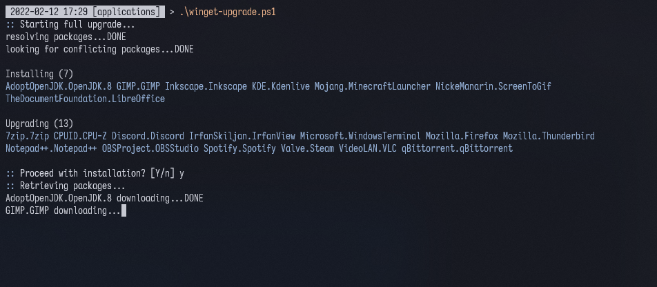

# winget bulk upgrade

Verify and install multiple packages from a package list.




## About

A PowerShell script that allows the user to install multiple packages using the Windows Package Manager (winget).<br/>
The [Windows Package Manager](https://docs.microsoft.com/en-us/windows/package-manager/winget/) is an open source client designed for command-line usage.

### Limitations to address
- `winget install` is unable to read multiple programs as positional arguments
- `winget upgrade` is unable to **selectively** upgrade a handful of packages

### Solution
This script asynchronously verifies the given package identifiers with a `winget show` query. If the given packages are valid, it then sequentially installs programs that are not already installed. In the case where a given program is already installed, the script will upgrade it only if a later version exists; otherwise, the upgrade is skipped.


## Usage

:bangbang: Save all your work before running this script. See [notes](#notes) below. :bangbang:

1. Update 'winget-upgrade.json' with the exact package identifier (case-sensitive), found using `winget search`.<br/>
For example, `winget search --moniker git` results in finding 'Git.Git'. Therefore, the json would be as follows.
```json
{
    "programs": [
        "Git.Git"
    ]
}
```

2. In PowerShell 5.1 (admin) or later, run the following command:
```
.\winget-upgrade.ps1
```


## Ideas
- [ ] Create logger
- [ ] Optimize successive runs by remembering recent package ID validations
- [ ] Install/upgrade a number of packages in parallel
- [ ] Install/upgrade by giving arguments instead of json
- [ ] Convert script into [module](https://docs.microsoft.com/en-us/powershell/module/microsoft.powershell.core/about/about_modules?view=powershell-5.1)


## Notes
- Unfortunately, using winget to install some programs (e.g. Visual Studio, Microsoft Teams, LibreOffice) triggers an **automatic system restart**. See [here](https://github.com/microsoft/winget-cli/issues/229
) to follow the GitHub issue thread. Make sure to **SAVE YOUR WORK** before running any `winget {install,upgrade}` commands.

